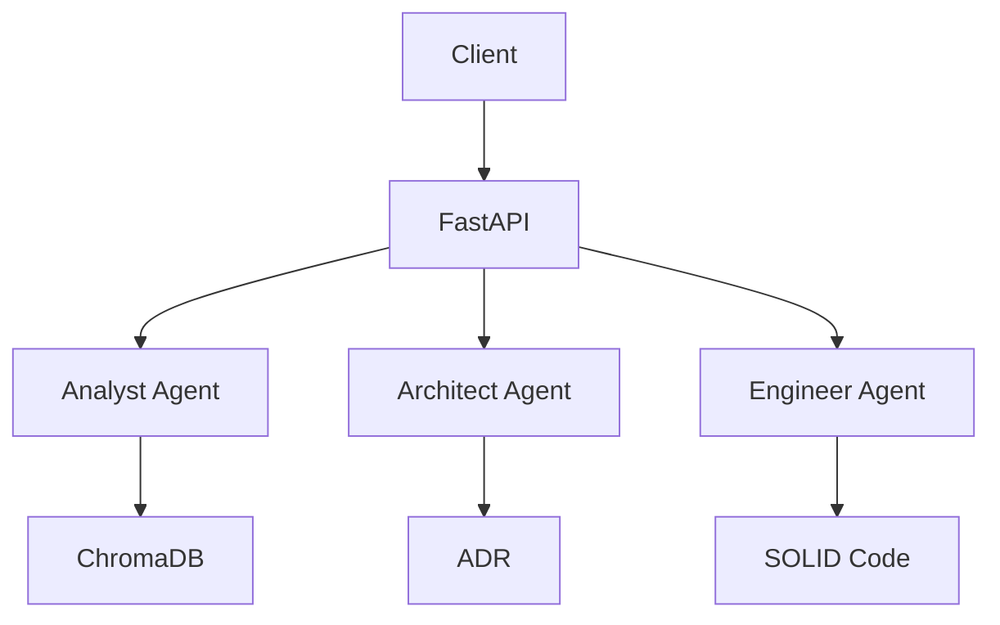

# AgenticArchitect
## Overview
A local-first multi-agent system for AI/ML projects.

### Components
- **Analyst Agent**: CDC analysis.
- **Architect Agent**: C4 diagrams, ADRs.
- **Engineer Agent**: SOLID code generation.

### Architecture Diagram

